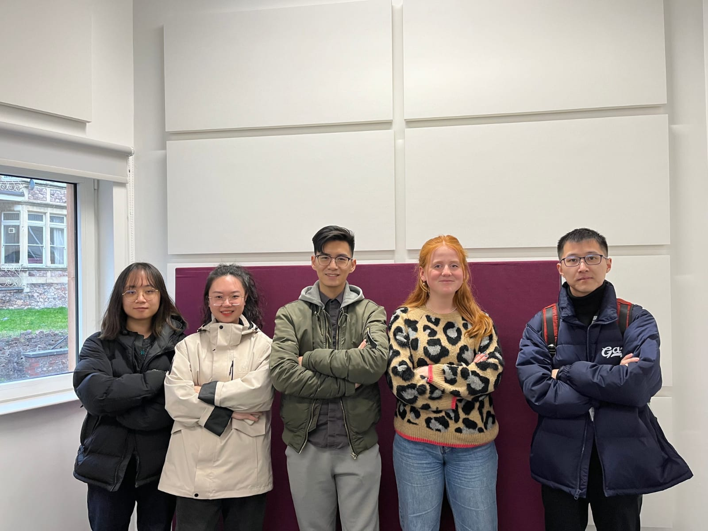
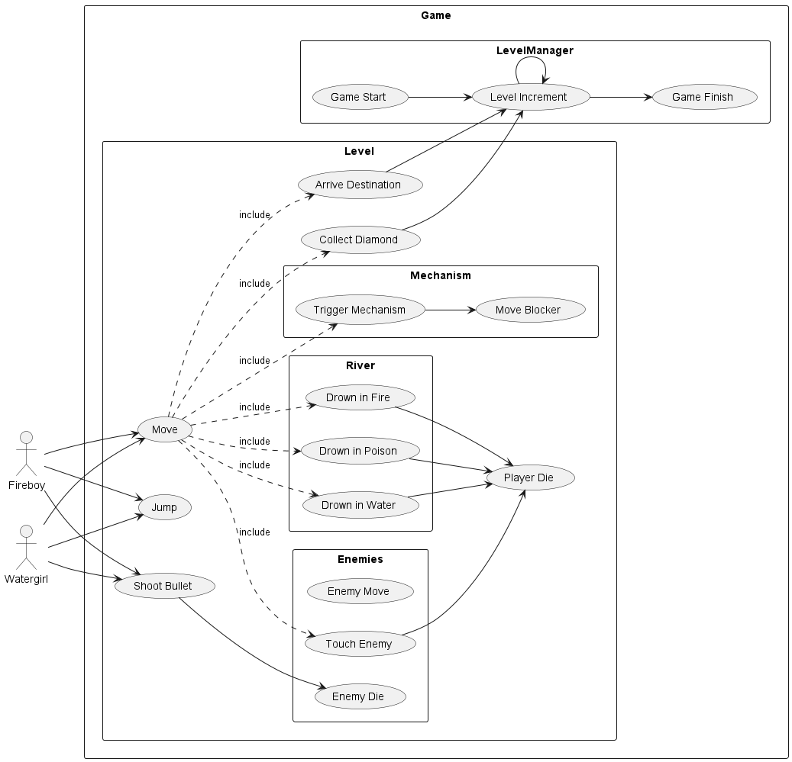
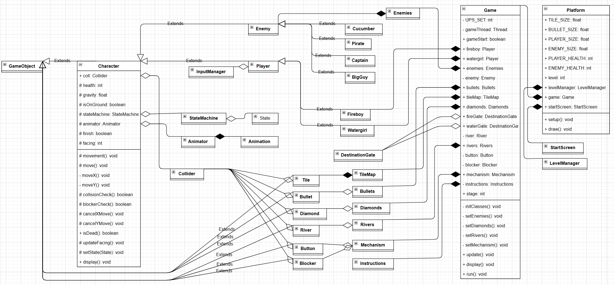
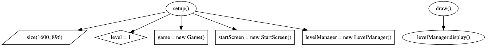
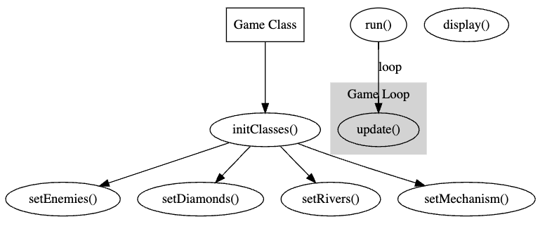
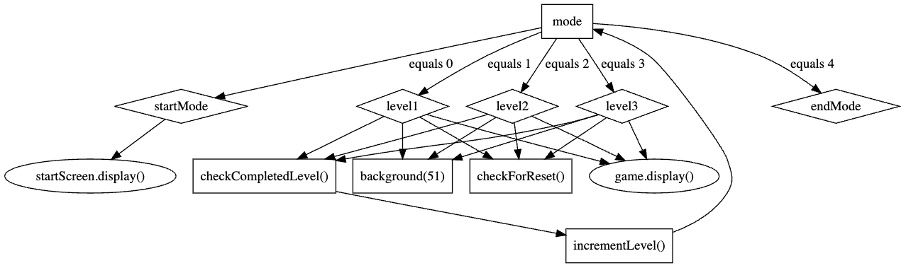

# 2023-group-12
## Team Members 

- Siru Zhang [@DryLichen](https://github.com/DryLichen)
- Yuewen Wang [@Xueling22](https://github.com/Xueling22)
- Shuxing Li [@hingsli](https://github.com/hingsli)
- Francesca Heyworth [@an19149](https://github.com/an19149)
- Zongjian Wang [@wangnevin](https://github.com/wangnevin)

## Resources
Some game sprite images resources:
- [spriters](https://www.spriters-resource.com/)
- [pixel-frogs](https://pixelfrog-assets.itch.io/)

## Game Ideas

- Angry Birds
- Flappy bird
- Platformer games (e.g. Mario)
- Cut The Rope
- Fruit Ninja
- Stack
- Pinball
- Fireboy and Watergirl
- Temple Run
    - Change the theme, on water, on ice/snow?
    - Might be tricky to animate
- Dinosaur Game
    - Make it two player

## Final Game Idea:

Fireboy and Watergirl
- Add an enemy, what could triger it?
- Adding weapons
- Triger to switch roles
- Boogie traps, e.g. I Wanna
- Make it into a competition - Fireboy vs. Watergirl 
- Add a time limit, the temple slowly filling up with water

## Paper Prototyping Video
https://github.com/UoB-COMSM0110/2023-group-12/blob/f13e531b67bb647df3174490a57dc1f48d43f8c1/Group12-paperprototyping.mp4

## Introduction

Enter a world of excitement and intrigue with our 2-player game, which takes inspiration from the wildly popular online game Fireboy and Watergirl. Get ready to embark on an epic journey through a mystical forest temple, filled with intricate puzzles and thrilling adventure.

With this game, players can look forward to testing their problem-solving skills as they work together to overcome obstacles and unlock new challenges. As they navigate through the twisting paths and hidden passageways of the temple, they'll need to utilize their unique strengths and collaborate with each other to reach their ultimate goal - escaping the temple together! With every level presenting new challenges and obstacles, players will need to stay on their toes and think quickly if they want to make it out.

In a bid to survive the treacherous forest temple, the dynamic duo of Fireboy and Watergirl must heed one crucial rule: stay in their respective lanes! With Fireboy vulnerable to water and Watergirl equally susceptible to fire, the stakes are high as they navigate through the ever-changing environment. But to make matters worse, they both must stay away from the hazardous green sludge. 

As a unique twist, we have incorporated enemies into each level. Players can eliminate these enemies by shooting them, but coming into contact with them will result in instant death and force the players to restart the level.

In order to complete each level and escape from the temple, players must work together to collect all diamonds and reach their designated doors.

(251 words)

## Requirements (15% ~750 words)

o Use case diagrams, user stories. Early stages design. Ideation process. How did you decide as a team what to develop?

### Use Case:
[Use Case Diagram](./Demo/usecasediagram1.png) please click here.

### User Stories:
- As a player, I want to move and jump so that I can arrive at the destination gate and avoid obstacles.
- As a player, I want to shoot bullets so that I can kill enemies to avoid harm.
- As a player, I want to collect diamonds so that I can meet the winning condition.
- As a player, I want to trigger mechanisms to clear obstacles or use the blocker as a springboard.
- As a player, I want to get a tutorial at the beginning of the game so that I can know how the game works.
- As a player, I want to restart in the middle of the game so that I can start the level again if players die.
- As a player, I want to know when I'm going to pass the whole game so I can finish the game.

### Overview: 
Development of a two-player game for collaborative play, similar to “Fireboy and Watergirl". It implements basic player movement, multiple interactive elements such as diamonds that can be collected, mechanisms that can be triggered, etc., and the game twists on enemies and weapons. The game contains several levels where the player can control the movement of the corresponding characters and move to the next level when the winning conditions are met and the end gate is entered, avoiding traps and defeating enemies if necessary.

### Objective:
- Develop a fun and engaging two-player game that appeals to a wide audience.
- Each level is progressively more difficult, including cooperative difficulty and operational difficulty. 
- Ensure smooth gameplay and controls for both players.
- Give players the necessary guidance at certain times, such as operation tutorials and playing animations.

### Early Stages Design:
During the ideation process, our team discussed various game genres. Eventually, we chose to twist "Fireboy and Watergirl", a game that has a wide audience, is lightweight, and has an excellent playing experience. We also brainstormed several games to find the appropriate aspects to twist for providing a richer experience for players. We chose to implement the original content of "Fireboy and Watergirl", with two players, traps, and levels. There are the classic actions of a 2D game: basic movement and jumping, as well as interactive elements, including river traps to jump over in the levels, players need to determine whether their character will drown in that river, and the ability to trigger blocker mechanisms and collect diamonds, but the difference is that we wanted to increase the difficulty of the game so that players must ensure that all the diamonds are collected in each level. This is a two-player game, both players must work together to solve the problem at hand and both enter their corresponding destination gates before they can finish the game. The game twist in adding enemies and handheld weapons for players, which were not present in the original "Fireboy and Watergirl", the player needs to kill the enemies if necessary, and if touches enemies while they are moving they will reduce their life expectancy and cause the player to die, so killing the enemies and then safely crossing over to where they occupied before. This makes for a very multi-dimensional experience: a collaborative multiplayer experience, the brainstorming process of solving trap puzzles, and the thrill of killing enemies.

All characters and interactable elements should be lifelike, for example, characters marching in different directions and dying are matched with corresponding animation effects, interactable elements disappear if they are acquired, mechanisms move position if their buttons are triggered, etc., all of which can tell to the players about their status so that the players can react accordingly.

We also considered the technical aspects of the game, including the basic classes and methods. The whole game was programmed by Processing, and we decided to design the GameObject class as the base class for all visible objects in the game, GameObject can own two fundamental methods: update and display, to refresh the state and render the screen respectively. we designed subclasses for each type of element, such as Character, Tile, and Bullet, River, Diamond, Mechanism, etc. Players and Enemies could inherit from Character Class to implement the methods. We also designed that the game should have an InputManager class to handle user input for each player.

To manage the game's different states and scenes, we designed the LevelManager class, which could implement judging winning conditions, load different levels, manage the start and pass animations, etc. The LevelManager would instantiate the Game class, which would contain instances of the TileMap, Bullets, Enemies, Player, and all interactive element classes.

Overall, our team's goal is to develop a challenging and entertaining two-player game that appeals to a wide audience by brainstorming and carefully planning the game's ideation and technical aspects.

## Design (15% ~750 words)

o System architecture. Class diagrams, behavioural diagrams.

This is the class diagram that illustrates the class hierarchy of our 2D platformer game.
[Class Diagram](./Demo/demo.drawio)

### GameObject
The top level of this hierarchy is occupied by the abstract class, GameObject, which is the base class for all visible objects in the game. It contains essential properties such as position, tag, width, and height. Additionally, it has two essential methods: "update" and "display". The "update" method updates the game object's state and is called every 1/120 second. The "display" method is responsible for drawing images on the screen and is called every frame (1/60 second).

The GameObject class has several classes that extend it, including Character, Tile, Bullet, Diamond, River, DestinationGate, Button and Blocker. These classes are responsible for creating and managing characters, tiles, and all the interactive elements in the game.
### Character
Two subclasses of the Character class are Player and Enemy, which represent the player character and the enemy characters, respectively. The Player and Enemy classes inherit all the properties and methods of the Character class, which handles the collision detection between character and platform while moving.

The players have the abilities of jumping and firing bullets, they can also collet diamonds in the map. Every enemy in scene has a patrol area in which they move from left to right. The bullets can reduce to health of hitted enemies, and players will lose health once touched the enemies as well.

There are two players in the game, namely Watergirl and Fireboy, which all extends from Player class, and four types of enemies namely Cucumber, Pirate, Captain and BigGuy, which all extends Enemy class. 

The Character class aggregates three classes: Animator, StateMachine, and Collider. This means that, besides inheriting properties, the Character class has instances of these classes, and it can use their functionality to control the state and animation of the character objects in the game.
### Animator
The Animator class has several instances of Animation stored in a HashMap. The keys represent different states, and the values represent instances of Animation. This class can use its functionality to play corresponding animations associated with a given state.
### Collider
Similarly, the Collider class is aggregated by Tile, Bullet and Character classes. The Tile, Bullet and Character classes have instances of Collider, and they can use its functionality to detect collisions between objects in the game. For example, to check if a bullet hits an enemy, or if player is standing on a platform.
### TileMap
The TileMap class is composed of the Tile class, which means that TileMap has all the instances of Tiles. It is used to create and manage tile objects in every map in the game.
### Diamonds, Rivers, Mechanism, DestinationGate
The Diamonds class is composed of Diamond class, the Rivers class is composed of River class and Mechanism class is composed of Button and Blocker cass. These are all elements that players can interact with. For example, players can collect diamonds, rivers can kill the players once touched. The blockers are controlled by buttons that when player stands on buttons, the blocker will be removed from path. To finish the level, players need to reach their corresponding gates, which are instance of DestinationGate class.
### Bullets
The Bullets class is composed of the Bullet class, which means that Bullets has all the instances of Bullet, and it can use its functionality to create and manage bullet objects in the game. A new oject of bullet is created and added to bullets once player fired.
### Enemies
Similar to Bullets class to Bullet, the Enemies class is composed of the Enemy class, and has all the instances of Enemy. It can use its functionality to create and manage all enemies in the game.
### InputManager
The InputManager class is aggregated by the Player class, which means that the Player class has an instance of InputManager, and it can use its functionality to handle user input for the player character in the game. Since this game is a multiplayer game with two players, each player has an inputManager that responds to its unique keyboard input.
### Game
The instances of TileMap, Bullets, Enemies, Diamonds, Rivers, Mechanism Watergirl and Fireboy are compositions of the Game class, which is a class for managing all the objects and game states. This means that the Game class has instances of these classes, along with other properties like gameStart and stage. Its functionality can be used to create and manage the different game state, like “game start” or “game over”, and game scenes, like “level 1” and “level 2”. It is also responsible for respawning enemies and players in every level and setting up the platform and interactive elements in scene.
### LevelManager
This class is responsible for managing the state of levels and transition between different levels. For example, the level will be increased once players clear current level, and the level can be reset by pressing 'R' on the keyboard.
### Platform
Finally, instances of Game, LevelManager, along with StartScreen are created in Platform. This is the starting point when launching the game.

## Implementation (15% ~750 words)
The implementation of our 2D two-player platformer game was primarily carried out using the Processing programming language. In this section, we will highlight three main challenges we encountered in the development process.
### Game Architecture
The architecture of the game was designed to be modular, maintainable and scalable, with a focus on separation of concerns and efficient use of resources. To achieve this, we design classes for updating game loop and managing the overal logic and state change. The Platform is the entry of our game where the setup() and draw() functions are implemented as shown in the following flowchart. 

The Game and LevelManager class are called here to initiate our game logic. Implementing the game loop was the first challenge we encountered, and to improve the game’s performance, we implemented our game loop based on the “Delta Time” method. In this type of game loop, the game loop measures the time elapsed since the last frame and uses that time to calculate how much the game state should be updated. Meanwhile, we created a new thread specifically for running the update logic of the game by making the Game class implement the Runnable interface, thus separating the value update logic from the rendering logic, as shown in the following flowchart. 

The LevelManager class manages the game state and difficulty switching, with its implementation details shown in the figure below.

### Level Design

We employed a manual level design process using text files to represent the map layout and game objects. 

We designed a custom format for representing the game’s levels using plain text files. Each character in the text file corresponded to a specific tile or game object, with a defined characters set representing the level layout. For example, we used the following characters: 
- ‘ ’: empty space
- ‘#’: wall
- ‘S’: players’ starting points
- ‘I’: ice rivers
- ‘P’: poison
- ‘F’: fire rivers
- ‘D’: diamonds
- etc.

Using the text-based format, we manually designed levels by creating text files with the desired layout of tiles and game objects. This approach allowed us to easily iterate on level designs and share them among team members for testing and feedback.

We implemented a custom level parser function in our game to read the text files and instantiate the corresponding game objects in the game. The parser looped through each character in the text file, creating the appropriate game object based on the character’s representation, and placed it at the corresponding position in the game world’s grid. This process allowed us to efficiently generate levels from the text files during runtime.

The visual design of each level was brought to life using a third-party assets called [pirate-bomb](https://pixelfrog-assets.itch.io/pirate-bomb).

### Game Objects

## Evaluation (15% ~750 words)

After developing a functional prototype for our game, we conducted an evaluation to pinpoint any potential usability issues. For our initial assessment, we chose to conduct a Heuristic Evaluation as it provides immediate feedback and allows for a more comprehensive analysis compared to a Think-Aloud Evaluation.

We chose 3 people to be our evaluators and coached them into experts by elaborating on the game's design and allowing them to look through our code. Our experts then went through the interface twice, the first time to get a feel for the system and the second time to focus on different elements & explore the game further. After the evaluator was satisfied with the time spent on the interface, we asked them to fill in a [form](https://github.com/UoB-COMSM0110/2023-group-12/tree/master/Evaluation/Heuristic/BlankForm.md) providing us with a list of possible usability problems, the usability principle and the design feature that violated it. All three forms can be found [here](https://github.com/UoB-COMSM0110/2023-group-12/tree/master/Evaluation/Heuristic/Forms).

As each expert only provided a small number of usability problems, we waited until after the session to send out a complete list of usability problems and asked the experts to rate them based on their severity. As you can see from the [severity scores](https://github.com/UoB-COMSM0110/2023-group-12/tree/master/Evaluation/Heuristic/SeverityScores.md), our usability problems in order of most significant to least are:

- The game glitched after releasing too many bullets
- Cannot press W&A at the same time
- How to complete a level is not clear
- Had to figure out which keys to use to move the players & shoot
- Keys are different to standard gaming conventions
- Can not distinguish between player and enemies
- Forgetting which keys to use when switching between players

As you can see, our biggest issue with the game was the glitching.  However, one of the experts provided a useful suggestion to address this problem. They recommended deleting the bullets once they had gone off of the screen in order to save memory and prevent the game from crashing. Due to the severity of this issue, we tackled it first and fortunately, this approach was successful in resolving the glitching issue. 

Also, our experts pointed out that the keys and objectives of the game are unclear, so we have taken steps to address this issue. Firstly, we have added a start page that provides instructions on how to play the game. Additionally, we have included the aim of each level at the top of the screen to help players understand what they need to do to progress. Lastly, we have made it easier for players to restart by providing instructions on how to do so at the top of each level, preventing them from becoming stuck in the game. These improvements should help enhance the overall gameplay experience for our users.

For our quantitative evaluation, we decided to conduct a system usability survey (SUS) as it can be used on small sample sizes and produces reliable results. We asked 5 people to play our game and then fill out the [survey](https://github.com/UoB-COMSM0110/2023-group-12/blob/master/Evaluation/SUS/Survey.md). We then calculated the scores from each user and got the following results:

| Player 1 | Player 2 | Player 3 | Player 4 | Player 5 |
| --- | --- | --- | --- | --- |
| 77.5 | 80 | 72.5 | 72.5 | 77.5 |

(click [here](https://github.com/UoB-COMSM0110/2023-group-12/blob/master/Evaluation/SUS/Results.md) to see the full results)

// NEED TO WRITE //

Although the two evaluations above contained black-box testing, we decided to do some more of our own. To thoroughly test our game, we played through all possible paths and scenarios. By doing so, we were able to identify and address any other issues, bugs or complications that may have arisen. This allowed us to ensure that our game is fully functional and provides an enjoyable user experience.

## Process (15% ~750 words)

### Development Process
At first, we held several brainstorming sessions to decide the game and the twist we were going to implement. We found it useful since everyone can express their thoughts, so a bunch of great ideas were generated from these sessions. Also, we could handle conflicts immediately and negotiate to get a suitable solution. Successfully, we reached an agreement on the goals and contents of the game.
We chose the agile methodology to manage our project since it was hard to get a specification at the beginning. Scrum is a widely used methodology in agile development. Due to the lack of time to follow a daily schedule, we decided to divide the development process into some short periods. In each development stage, we got an executable game with some functions expected to implement in that version. For instance, in the first version, we’ve only got a game with one level and one player without weapons and enemies. Then, other elements like river, diamond and other maps were added to our game.
Another tool we used in agile development was Kanban. We had an offline meeting every time we stepped into another stage of development. Most of them were held in the form of brainstorming. Every member introduced the work they’d done then and discussed the features to be implemented. After a meeting, we recorded tasks categorized by in-progress, to-do and done in the WhatsApp group.
We valued communication. Apart from offline meetings, we communicated through WhatsApp, from which we can message a certain person or the whole team instantly. When some glitches were found or the game was updated, our members can give a response immediately. Using this online instant messaging app has greatly improved communication efficiency. 
The tool that we used most was GitHub. And it turned out that it made our collaboration much more efficient. After some discussion, we clarified the duty of every member.  There are five branches for every member personally, a develop branch for merging and a main branch for the final version of the game. Every time we tried to modify or add some features, we would pull the develop branch, which contained the newest version. When it comes to pushing, we merged our branch into develop branch and updated the two branches together.

### Team Roles
We assigned a specific role to every member according to their preference and strength. Although members took charge of different parts, we shared thoughts regularly and considered the availability and comprehensibility of APIs in separate sections. 
Yuewen was in charge of the requirement section and the implementation of maps at every difficulty level. Specifically, she designed three new maps and then added elements like lava, diamonds, and buttons.
Zongjian took the responsibility of designing and coding the whole system structure and finished the design section. He drew the UML class diagram and specified the function of each class, which made our development process clearer and easier. Also, the significant part – the twist of adding enemies and weapons was implemented by him.
Hings was responsible for the implementation section and the implementation of multithreading. His work has resulted in smoother animations and controls throughout the game. Also, he helped fix some glitches in bullet reusing, which increased the robustness of the system.
Francesca was responsible for the evaluation section and the implementation of the level Manager. She also designed our game's opening animation and victory scene, contributing to improving the user experience.
Siru was responsible for the process section and the implementation of multiple players, which is based on Zongjian’s work. She helped to implement the control of the second player. 

### Reflection
Overall, we worked together well. Agile development allows us more flexibility especially when we don’t have a specific plan. We can also continuously improve and change features when we get feedback from evaluators or when we come up with better ideas. Also, the assignment of roles and use of GitHub encourage the increase in productivity since every member has clear accountability. We can easily identify issues and complete every required task. 
However, there are still some areas that we could improve in the development process. One of them is equal contribution. Because of the imbalanced workload in each area, some members make more efforts on specific features. Although it’s hard to distribute work in a completely fair way, we should adjust everyone’s workload in the process of development.
Another critical challenge is efficient communication. For obvious reasons, it’s easy to record to-do lists and use Kanban in WhatsApp groups. But if we chose to use some online tools like Jira, the recording of tasks would be much more professional. Also, using online meeting software like Zoom instead of text message can help to save time. 

## Conclusion (10% ~500 words)

o Reflect on project as a whole. Lessons learned. Reflect on challenges. Future work.

## Individual contribution. 
Provide a table of everyone's contribution, which may be used to weight individual grades. We expect that the contribution will be split evenly across team-members in most cases. Let us know as soon as possible if there are any issues with teamwork as soon as they are apparent.

